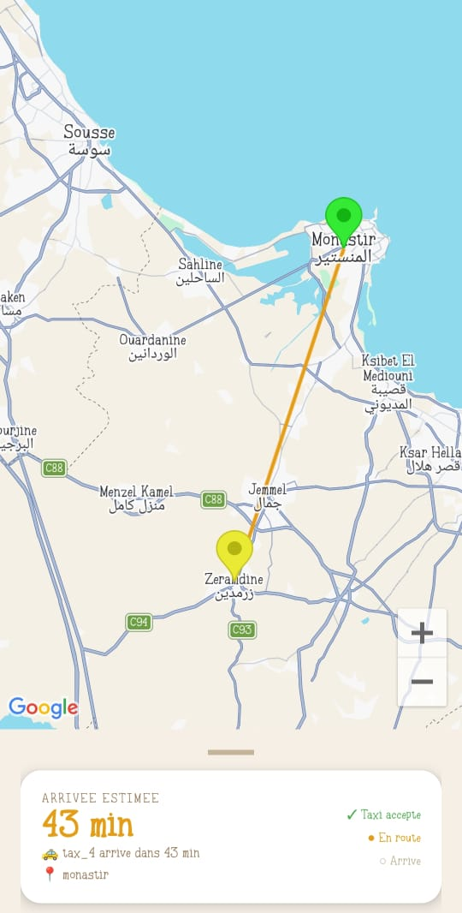
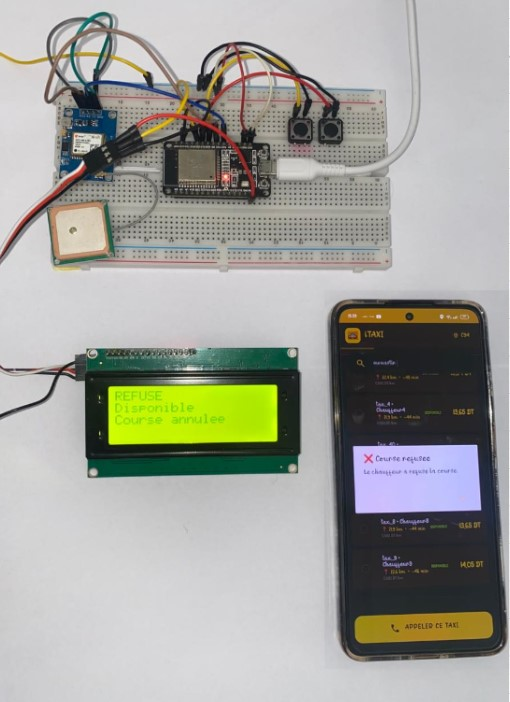

# Portfolio - Souha Dandana
 Jeune diplômée en Licence Réseaux, Internet des Objets (IoT) et Systèmes Embarqués de l'Institut Supérieur d'Informatique et de Mathématiques de Monastir (ISIMM).Je suis passionnée par les réseaux, les systèmes embarqués et les technologies IoT.

#  Compétences techniques
## IoT & Systèmes embarqués
- Arduino
- ESP32
- STM32
- Capteurs
- Communication série

## Réseaux
- Configuration Cisco
- Routage
- Protocoles de communications 
- Architecture IOT

## Programmation
- Python
- C
- Java
- HTML
- CSS

## Bases de données
- MySQL
- Firebase

#  Projets
##  Projet de Fin d'Études

### iTAXI : Systéme de Réservation Intelligent de Taxis 

### Description
Ce projet de fin d'études consiste à développer iTAXI, une solution IoT innovante dédiée à la gestion des réservations de taxis. Son objectif est d'optimiser la mobilité urbaine en réduisant les coûts de trajet et le temps d'attente des clients, tout en proposant une application mobile accessible aux utilisateurs standards ainsi qu'aux personnes malvoyantes grâce à un assistant vocal permettant de commander un taxi et de suivre leur trajet.

Le système repose sur un boîtier embarqué basé sur le microcontrôleur ESP32, intégrant un module GPS NEO-6M, un écran LCD 4x20 et deux boutons-poussoirs permettant au chauffeur d'accepter ou de refuser les courses.

L'architecture IoT s'appuie sur une communication bidirectionnelle entre le boîtier embarqué et l'application mobile via Firebase. Les données, structurées au format JSON et échangées par des API Web, assurent une synchronisation en temps réel. Grâce à la combinaison d'une intelligence embarquée et de fonctionnalités accessibles, iTAXI constitue une solution innovante et inclusive pour la mobilité intelligente.

### Technologies utilisées

- Android Studio
- Arduino IDE
- Github
- Firebase
- Altium Designer
- WiFi
- GPS NEO 6M

  
### Fonctionnalités principales

### Client standard
Authentification : création de compte et connexion à la plateforme.

Recherche des taxis disponibles : affichage en temps réel des taxis via Firebase avec leur identifiant, statut, distance et prix estimé.

Réservation d’un taxi : sélection du taxi, saisie de la destination et transmission des informations au chauffeur.

Suivi en temps réel : visualisation du trajet sur une carte avec le parcours et le temps restant.

Favoris et historique : consultation des trajets et réservation rapide depuis les taxis favoris.
### Client malvoyant
 Commande vocale : authentification et interaction avec l’application par la voix.
 
 Recherche et sélection vocale : annonce des taxis proches et choix d’un taxi par son identifiant.
 
 Guidage vocal : suivi du taxi et indication de la distance en temps réel.
 
Gestion vocale : consultation de l’historique et gestion des favoris.
### Système IoT du taxi
Géolocalisation GPS : suivi de la position du taxi avec ESP32 et envoi des données vers Firebase.

Affichage LCD : affichage de la destination, de l’identifiant et du type du client.

Mise à jour du statut : passage automatique du taxi de disponible à occupé après validation.
### Chauffeur
Gestion des courses : réception des informations du trajet sur l’écran LCD.

Acceptation ou refus : contrôle de la demande avec des boutons-poussoirs.

Automatisation : communication Firebase et suivi GPS gérés automatiquement par l’ESP32.

## Captures d'écran

### Application mobile

### Système embarqué

##  Projet avec arduino

### Tende Motorisée Automatique avec Capteur de Lumière et LED

### Description

Le but de ce projet est de concevoir une tende motorisée automatique qui s'ouvre et se ferme en fonction de la luminosité ambiante. Le système sera constitué d'un capteur LDR (photo-résistance) pour mesurer la lumière, d'un servo-moteur pour contrôler le mouvement de la tende, et d'une LED pour indiquer visuellement l'état de la tende (ouverte ou fermée).

### Matériels utilisées

- Arduino Uno
- Capteur LDR (photo_résistance).
- Servo-moteur pour contrôler l'ouverture et la fermeture de la tende.
- LED pour indiquer l'état de la tende (ouverte ou fermée).
- Résistance pour le capteur LDR.
- Fils de connexion. ARD
- Alimentation (Pile).

### Fonctionnalités principales
  ## Lecture de la luminosité :
  Le capteur LDR mesure la quantité de lumière ambiante. Lorsque l'intensité lumineuse dépasse un certain seuil, le système interprète cela comme un signal pour ouvrir la tende.
## Contrôle du servo :
Si la luminosité est suffisamment élevée, la tende s'ouvre (servo à 90°). Si la luminosité est faible, la tende se ferme (servo à 0°).
## LED :
La LED s'allume pendant que la tende est en mouvement (ouverture ou fermeture) et s'éteint une fois le mouvement terminé.
## Seuil de luminosité :
Le seuil de luminosité est défini dans le code et peut être ajusté selon les besoins.

